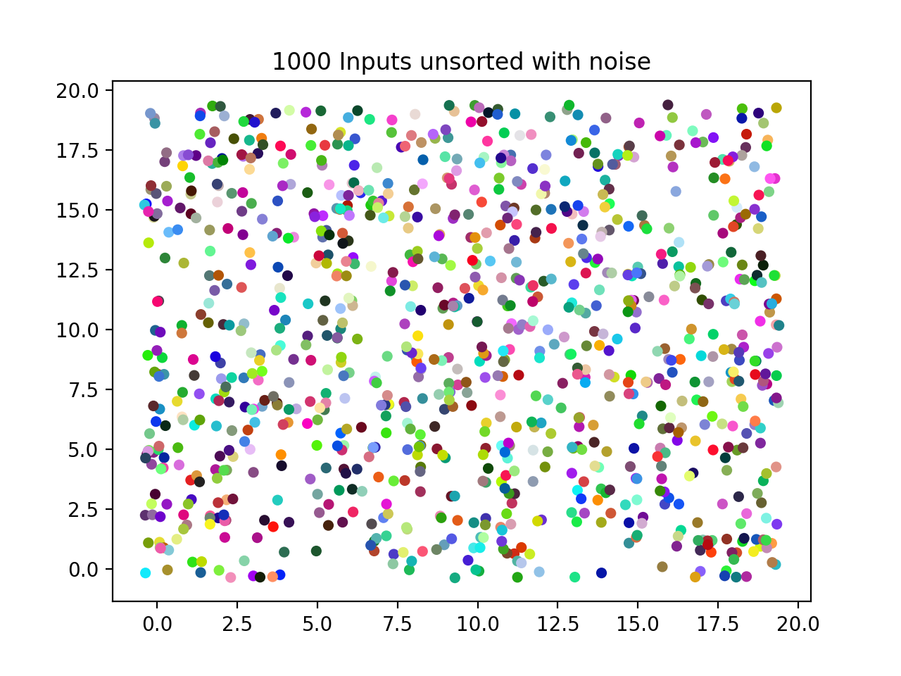
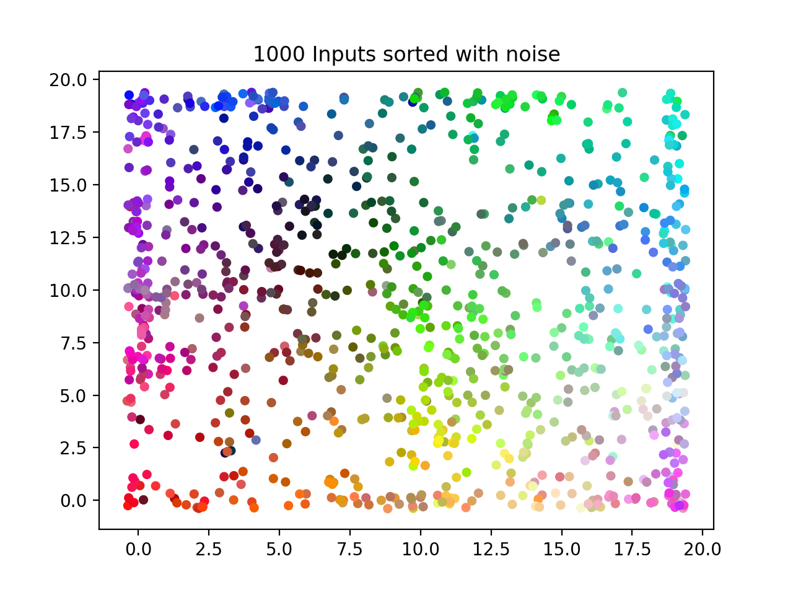

# EMNIST-Kohonen-SOM

# Goal
Use Kohonen's algorithm to make a Self Organising Maps for 3 different datasets:

- RGB Dataset
- Iris Dataset
- EMNIST Balanced Dataset

The principal goal of this project is the implementation of a Kohonen Network as an application, in order to demonstrate its usefulness and explain the concepts of Machine Learning, by means of a converging Self-Organising Map.

The aim is to provide an in-depth study of Kohonen’s algorithm, and present insights of its properties, by designing and implementing a complete and functional model. 

# Install

## Data
The balanced EMNIST dataset can be downloaded from [here](https://drive.google.com/drive/folders/14CQxzXz2zGFFW0kkmSbJ_gH50O6bha3a?usp=sharing).

Please download the `Sorted` folder, and place it in `EMNIST-Kohonen-SOM/static/data/` for `som.py` to work.

## Libraries

To execute the attached scripts, Flask, NumPy, Pandas, Matplotlib are required as a framework.

```
$ pip3 install flask
$ pip3 install numpy
$ pip3 install pandas
$ pip3 install matplotlib
```

The following used libraries are natively pre-installed in Python, but are nonetheless listed below:

```
• argsparse 
• sys
• datetime
```
## Virtual Environments


If necessary, virtual environments can be used to keep the libraries installed for the entire working machine seperate from those simply required for a specific task. This ensures that the libraries for this project don’t get change or mix up with the development PC’s native Python installation.

```
$ pip3 install virtualenv
$ cd ~/myPath/EMNIST-Kohonen-SOM/
$ virtualenv myFolder 
$ source myFolder/bin/activate 
$ pip3 install myPackages
$ deactivate
```

## Updating Script Parameters
The parameter of each model can be updated. The arguments can be individually viewed:
```
$ python3 iris.py  --help
```

Which will return:

```
Make a 2D map of a multidimensional input
optional arguments :
−h, −−help show this help message and exit −d, −−debug Print debug messages to stderr
−r RATE, −−rate RATE Choose learning rate (range: 0−1)
```

Samples commands:
```
$ python3 RGB.py -d -r=0.8 -i=1000
$ python3 iris.py -d -r=0.3
$ python3 som.py -d -r=0.3 -iTr=100 -iTe=100 -t=d
```
Where:
```
-d is the debug flag
-i is the number of inputs
-r is the learning rate
-iTr is the number of training inputs
-iTe is the number of testing inputs
-t is the flag to choose between digits (d), letters (l), or combined (c)
```

## Common Bugs

Use the following commands to fix the given bugs:

- Bug: `TypeError: Couldn't find foreign struct converter for 'cairo.Context'`
	- Solution: `sudo apt-get install python3-gi-cairo`

- Bug: `som.py:595: UserWarning: Matplotlib is currently using agg, which is a non-GUI backend, so cannot show the figure.
  plt.show()`
	- Solution: `sudo apt-get install python3-tk`

## Running Flask

Finally the project can be run by executing app.py on the terminal: 
```
$ python3 app.py
*Running on http://127.0.0.1:5000/ (Press CTRL+C to quit)
```
And then on a browser simply navigate to: `http://127.0.0.1:5000`. The website is now viewable.

## Sample Visualisation
Before:

After:


On the entier EMNIST dataset (of 47 classes):

